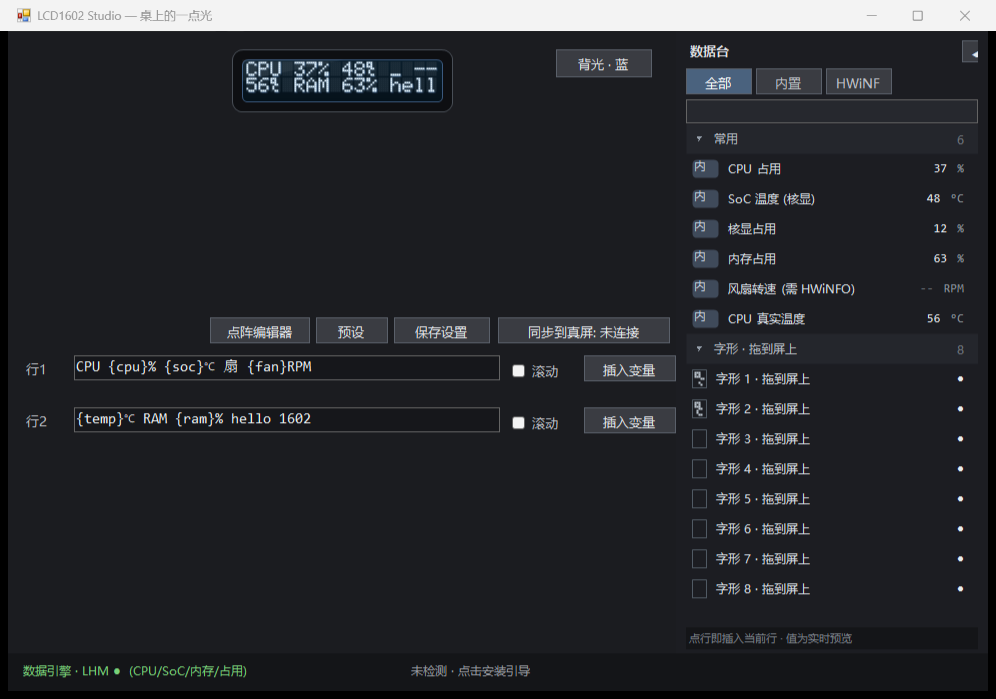
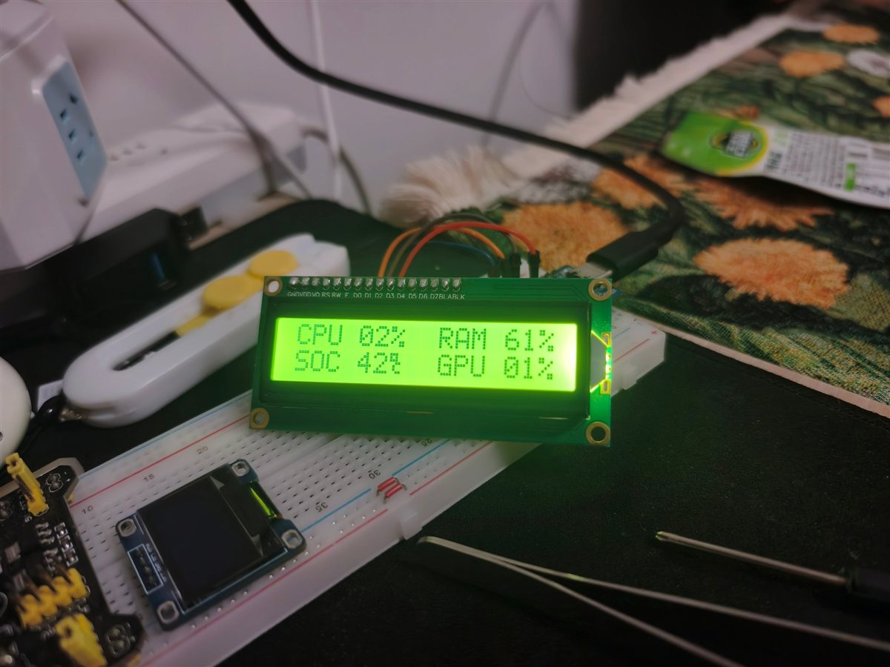
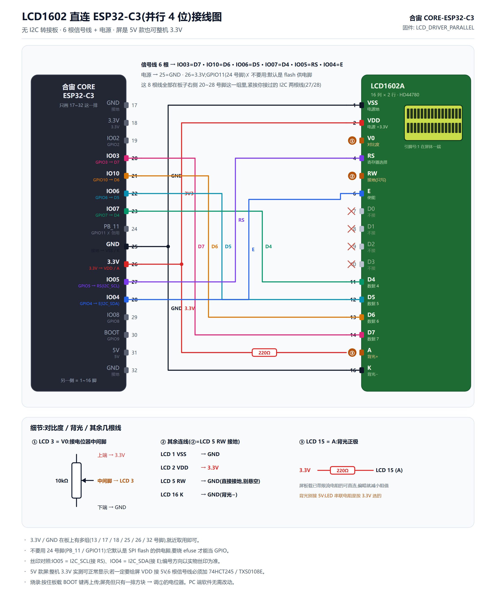

# LCD1602 Studio

**中文版 → [README.md](README.md)** · English: you are reading it

A desktop **1602 LCD workbench** — it simulates a real HD44780 LCD1602 on your computer
(5x7 dot matrix, blue/green backlight, marquee scroll), lets you edit the two display lines
(free text + live variables), and **syncs what you see to a real ESP32-C3 + LCD1602** (WYSIWYG).

Bundled hardware: 合宙 (LuatOS/AirM2M) CORE ESP32-C3 + PCF8574 I2C adapter + LCD1602.

```
PC side LCD1602Studio.exe (C#/WinForms, zero installs, compiled with Windows built-in csc)
   ├── Data engine: LibreHardwareMonitorLib (CPU/SoC/memory/load, MPL-2.0)
   ├── Optional HWiNFO shared-memory backend (laptop fan / real CPU temps, 280+ readings)
   └── USB serial 115200 → ESP32-C3 (firmware/lcd_monitor.ino)
                              └── I2C (GPIO4=SDA, GPIO5=SCL) → PCF8574 → LCD1602
```

## Features

- **LCD1602 simulator**: self-drawn 5x7 dot matrix (not a font render), blue/green/off backlight,
  unlit pixels visible, marquee for long lines; **scales up with the window** (up to 13 px per dot,
  ~1300 px wide when maximized), background and glyph bitmaps are cached so **the 1 Hz refresh never flickers**
- **ASCII-only input**: a real 1602 only supports ASCII — typing Chinese etc. is **filtered automatically**
  with a warning (`℃` and `°` excepted, they map to a custom glyph / ROM)
- **WYSIWYG sync**: a "Sync to screen" toggle finds the ESP32 serial port automatically and pushes
  the rendered two lines every second
- **Dot-matrix glyph editor**: hand-draw 5x7 custom characters (8 CGRAM slots), thumbnail list,
  **drag a glyph onto any cell of the simulator** → inserts a `{g1}`~`{g8}` placeholder at the right
  position; glyphs are pushed to the real LCD's CGRAM (℃, ★, ♥ …)
- **Data deck**: search + [All | Builtin | HWiNFO] segments + **collapsible groups**
  (Common / HWiNFO·Temperature / HWiNFO·Fan / HWiNFO·Usage / Glyphs), type badges
  (inner/temp/fan/usage), right-aligned live values, one-click collapse
- **Command palette**: the "Insert variable" button opens a ⌘K-style search panel
  (Enter inserts, Esc closes, live value preview)
- **Variable slots**: `{cpu}` `{soc}` `{gpu}` `{ram}` `{fan}` `{temp}` + any HWiNFO reading;
  numbers are zero-padded to two digits (06) to avoid layout jitter; `--` means unavailable
- **Presets**: save/load/delete whole templates (two lines + scroll + backlight)
- **Tray background**: clicking X minimizes to the notification area (double-click to restore,
  right-click to quit) — the app keeps running and syncing the real display
- **Zero install**: built with the .NET Framework compiler that ships with Windows — no SDK, no runtime

> Real screenshot:

> 

## Quick start (PC side)

```
Windows 10/11
1. git clone this repo, enter studio/
2. Double-click build.bat     → downloads LibreHardwareMonitorLib (MPL-2.0) on first run
3. Run LCD1602Studio.exe      → start editing your "screen"
```

Optional data source: click "HWiNFO" in the status bar, install HWiNFO64 and enable
Shared Memory Support. This tool only reads HWiNFO's public shared-memory interface and
does not bundle any HWiNFO component (see THIRD_PARTY_LICENSES.md).

## Hardware (tested with this exact setup — see [HARDWARE.en.md](HARDWARE.en.md))

| Part | Model | Notes |
|---|---|---|
| Dev board | **合宙/LuatOS CORE ESP32-C3** | ESP32-C3 single core, onboard CH343 USB-UART, LED D4=GPIO12 |
| Display | **LCD1602A** (tested: yellow-green backlight/black text; blue & 3.3V variants also available) | HD44780-compatible, 16×2, 5x7 dots, no ℃ glyph in ROM (custom CGRAM) |
| Adapter | **PCF8574 I2C adapter** (55782 kit) | Default 0x27, blue contrast potentiometer on board |
| Host PC | **AMD Ryzen 7 8845HS + Radeon 780M iGPU** laptop | mobile Zen4; Tctl requires HWiNFO; no fan sensor on this machine |
| Power | everything at **3.3V** (ESP32-C3 GPIOs are not 5V tolerant) | do not use 5V |

> Full tested config / pin map / toolchain versions / pitfall log → [HARDWARE.en.md](HARDWARE.en.md)
> (hold BOOT to flash, use `begin()` not `init()` in the LCD lib, CGRAM bit order, the ℃ mystery…)

### Real hardware photo (author's bench)



Above: a USB-powered ESP32-C3 (left; its onboard OLED is unused here) drives a PCF8574
adapter → yellow-green LCD1602A, displaying the user's custom template
`CPU 02% RAM 61% / SOC 42° GPU 01%` (two-digit zero padding, ° from ROM).

### Wiring (real LCD)

**Option A (default, I2C adapter, 4 wires):**

| Adapter | ESP32-C3 | Pin |
|---|---|---|
| VCC | 3.3V | pin 26 (or 18) |
| GND | GND | pin 25 (or 17) |
| SDA | GPIO4 (I2C_SDA) | pin 28 |
| SCL | GPIO5 (I2C_SCL) | pin 27 |

> Whole module powered at 3.3V; if the screen is lit but blank, turn the blue contrast
> potentiometer on the adapter.

**Option B (no adapter, LCD wired straight to the board in 4-bit parallel, 6 signal wires):**

| LCD1602 | ESP32-C3 | Note |
|---|---|---|
| 1 VSS | GND | |
| 2 VDD | 3.3V | a 5V-spec panel also works at 3.3V |
| 3 V0 | 10k pot wiper | pot ends to 3.3V / GND, contrast |
| 4 RS | GPIO5 | |
| 5 RW | GND | write-only, saves a wire |
| 6 E | GPIO4 | |
| 7~10 D0~D3 | not connected | 4-bit mode uses D4~D7 only |
| 11~14 D4~D7 | GPIO6 / GPIO7 / GPIO10 / GPIO3 | |
| 15 A | 3.3V via 100~220Ω | backlight+ |
| 16 K | GND | backlight− |

> Switch with one firmware line: `#define LCD_DRIVER  LCD_DRIVER_PARALLEL` — **the PC-side
> software needs no change**. The parallel driver is self-contained
> (`firmware/LcdParallel.h`) and **needs no LiquidCrystal library**. If you feed the LCD's
> VDD from 5V, the signal lines must go through a 74HCT245/TXS0108E level shifter.
> Details: [HARDWARE.en.md](HARDWARE.en.md) section 6.

**Wiring diagram (PNG — click to zoom; vector version [docs/wiring.svg](docs/wiring.svg) prints cleanly):**



## Firmware flashing (Arduino IDE)

1. `firmware/lcd_monitor.ino`; library: `LiquidCrystal_I2C` (YwRobot/PCF8574 version —
   only needed for option A; the direct parallel mode needs no library at all)
2. Tools menu: board `esp32 → AirM2M CORE ESP32C3`; **USB CDC On Boot = Enabled**
3. Upload (if the auto-download circuit fails: hold the onboard BOOT button and click Upload)

## Extension modules (PC side, zero firmware changes)

The display only displays; every feature lives in a PC-side module. Adding a data source =
write a module + register one line — **the ESP32 firmware never changes**.
See [MODULES.en.md](MODULES.en.md) / [MODULES.md](MODULES.md).

| Module | Variables | Notes |
|---|---|---|
| **DSH** | `{dsh.state}` `{dsh.min}` | busy / idle / not running + minutes since last activity (session-file activity + API connection) |
| **DeepSeek** | `{ds.bal}` `{ds.bal.grant}` `{ds.bal.top}` `{ds.bal.age}` | account balance (DSH cache first, auto-refresh via official `/user/balance`) |
| | `{ds.peak.now}` `{ds.rate}` `{ds.peak.in}` `{ds.peak.left}` | off-peak window: current rate / time until off-peak / time left (computed locally) |

Config: `%APPDATA%\LCD1602Studio\modules.ini` (auto-created with comments).
Example template: `CPU {cpu}% DS {ds.bal}` / `{dsh.state} {ds.peak.in}`

> Privacy: the API key is read locally only (from `~/.dsh/.credentials.yaml` or typed in);
> never logged, never uploaded, never committed.

## Serial protocol (115200)

```
L0,<scroll 0/1>,<text>\n          # line 1 (text may contain commas; 16 cols; scroll = marquee)
L1,<scroll 0/1>,<text>\n          # line 2
CG,<slot 0-7>,<8 row bytes>\n     # custom glyph (CGRAM)
Legacy format still supported:    C:<cpu>;S:<soc>;F:<fan>;M:<mem>\n
Special bytes: 0x01..0x08 → CGRAM slots 0..7; 0xDF = ° (ROM degree sign)
```

## Repository layout

```
lcd1602-studio/
├── studio/      Desktop GUI (LCD1602Studio): sources + build.bat (auto-downloads LHM) + Modules/
├── firmware/    ESP32-C3 firmware (lcd_monitor.ino)
├── monitor/     Legacy console host (monitor.cs, protocol-compatible, fixed layout)
├── docs/        Screenshots
├── LICENSE              MIT
├── README.en.md          English docs (this file)
├── HARDWARE.md / HARDWARE.en.md  Tested hardware list (CN/EN)
└── THIRD_PARTY_LICENSES.md
```

## Known limitations

- Laptop mode: LibreHardwareMonitor cannot read Tctl on AMD mobile CPUs (8845HS etc.) —
  a known open-source issue. This tool uses the SoC iGPU temperature instead; with the
  HWiNFO backend `{temp}` is the real Tctl/Tdie.
- Fan speed on this board/laptop: neither LHM nor HWiNFO exposes an EC sensor
  (0 fan readings out of 282 in a live dump) — `{fan}` showing `--` is a hardware limit.
- Non-ASCII characters (Chinese etc.) render as underscores on the LCD (HD44780 limit);
  each line is 16 ASCII columns.

## License

Project code is **MIT**; third-party components are listed in
[THIRD_PARTY_LICENSES.md](THIRD_PARTY_LICENSES.md).
